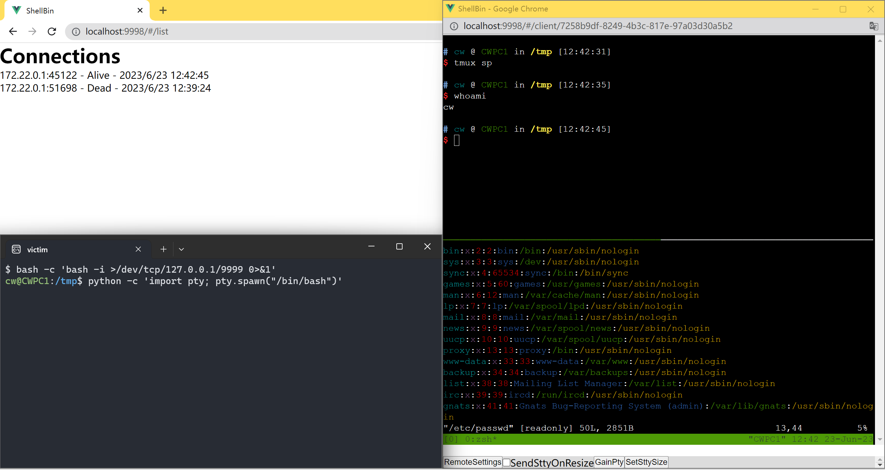

# ShellBin

[中文文档](README_zh.md)

Elegantly receive reverse shell.

Receive multiple reverse shells on one port, and manage them in a web UI.

vi, tmux commands even works ( you may need to gain pty, and set correct stty size. )



## Running

Recommended to use Docker.

```
make backend-environment
make frontend-environment
make docker
```

copy the `docker` folder to you VPS and run `docker compose up -d --build`.

you may want to change `docker/config/config.yml` it contains the username and password (default is admin:admin).

you may also want to change the ports in `docker/docker-compose.yml` (default is 9998:3000 and 9999:3001).


## development

```
make backend-environment
make frontend-environment
```

## build docker

```
make docker
```

## security & performance

This app is in prototype stage, it is generally secure, but not performant optimized, and the UI is not pretty,

pull requests are welcome.

## Roadmap

- [x] web UI with list of connected shells and using [xterm.js](https://xtermjs.org/) to display colored shell
- [x] authentication required for web UI
- [x] receive reverse shell
- [x] automatically remove dead connections
- [ ] fancy web UI
- [ ] resize terminal and send terminal event (currently you need to do `stty` command)
- [ ] snippets ( eg. `find / -perm 4000 2>/dev/null` )
