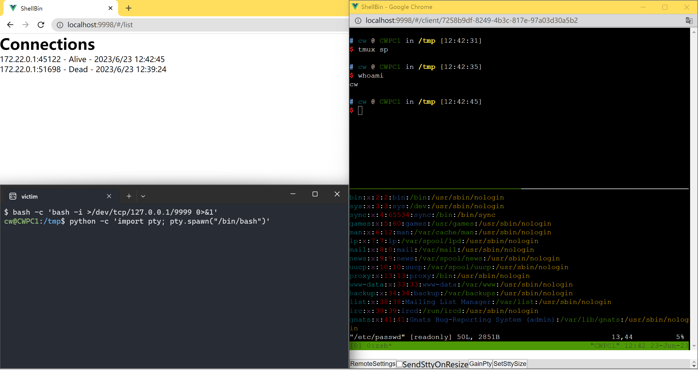

# ShellBin

优雅地接收反向 shell。

在一个端口上接收多个反向 shell，并在 Web UI 中管理它们。

甚至可以使用 vi、tmux 命令（您可能需要获得 pty）。



## 运行

建议使用 Docker。

```
make backend-environment
make frontend-environment
make docker
```

将 `docker` 文件夹复制到您的 VPS 上，并运行 `docker compose up -d --build`。

您可能需要更改 `docker/config/config.yml`，其中包含用户名和密码（默认为 admin:admin）。

您可能还想更改 `docker/docker-compose.yml` 中的端口（默认为 9998:3000 和 9999:3001）。


## 开发

```
make backend-environment
make frontend-environment
```

## 构建 Docker

```
make docker
```

## 安全性和性能

此应用程序处于原型阶段，通常是安全的，但未经过性能优化，UI 也不太美观，欢迎提交 pull requests。

## 路线图

- [x] Web UI，显示连接的 shell 列表，并使用 [xterm.js](https://xtermjs.org/) 显示彩色 shell
- [x] Web UI 需要身份验证
- [x] 接收反向 shell
- [x] 自动删除死连接
- [ ] 炫酷的 Web UI
- [ ] 调整终端大小并发送事件
- [ ] 代码片段