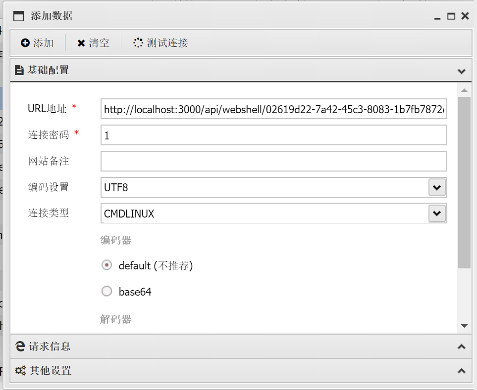

### Reverse Shell to Antsword Webshell

In AntSword, create a shell using the copied link.

use Connection Password 连接密码 "1" or "command".

use Connection Type 连接类型 CMDLINUX for linux and PSWINDOWS for windows.

use Default encoders and decoders 编码器/解码器, or os type detection will error.

#### limitations

The shell you're using must be /bin/sh(dash). bash does not work because bash strips tab symbols. This is a problem of Antsword's command.

Can't have a command execute of more than 10 seconds.

Download File gives couples of more bytes than original file, seems like it's a problem of Antsword's command. (crlf issue)

Database management not working(gives wrong list of database list), seems like it's a problem of Antsword's command.